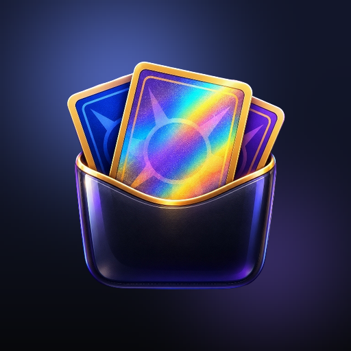

<div align="center">



# Pocketful

**Every card, in its pocket.**

A trading-card collection tracker for Android, built with Kotlin Multiplatform and Compose.
Binders that look like binders, real market prices, and a catalog of every set ever printed.

</div>

---

## What it does

Pocketful is built around the way people actually keep cards: in binders, in boxes, in
toploaders on a shelf. So that is what it models.

- **Binders are pages, not lists.** Nine-, twelve- or sixteen-pocket layouts, drawn as a
  spread you turn. A pocket is either empty, holding a card you own, or held open for one
  you want — and a want list is just a binder with gaps in it.
- **Containers for everything else.** A box of bulk is not a grid and does not pretend to
  be one. Decks, slabs, toploaders, shoeboxes: an ordered pile with a label.
- **Real prices.** Every card is matched against [TCGdex](https://tcgdex.dev) on launch and
  carries the TCGplayer market quote for its finish. Cards that cannot be matched exactly
  are left exactly as they were rather than being guessed at.
- **The whole catalog, browsable.** Every set across every era, sorted four ways, with a
  checklist per set and two ways to turn one into a binder: a set binder, which opens one
  pocket per card in the printing that card actually exists in, or a master set, which
  opens a pocket for every *variation* of every card — holo and reverse holo included.
- **One game at a time.** The printed Pokémon TCG (203 sets, 20 eras) and Pokémon TCG
  Pocket (15 sets) are browsed apart, because they are two games rather than two eras of
  one — a TCG Pocket card cannot be sleeved, sold, or priced. The upstream catalog files
  them together; the app does not.
- **A trade table.** Flag cards as available, and see what is on offer against what you
  are still chasing.

## Screens

| Launch | Home | Binder page |
|:--:|:--:|:--:|
| The loading screen doubles as the app's warm-up: set index, price match and artwork all arrive before the first screen does. | Portfolio value, best cards, and where everything lives. | A real page spread, with prices in the pockets. |

## Building it

Requires JDK 21 and the Android SDK (compileSdk 36).

```bash
git clone https://github.com/TronVonDoom/Pocketful.git
cd Pocketful
./gradlew :composeApp:installDebug
```

That is the whole setup. `local.properties` is generated by the IDE, or write it yourself
with `sdk.dir=/path/to/Android/Sdk`.

### Project layout

```
composeApp/src/commonMain/kotlin/app/pocketful/
├── data/        the card catalog, prices, GitHub releases, saved and exported files
├── domain/      binders, containers, copies, money — no Compose in here
├── state/       the store, the catalog browser, the launch bootstrap
└── ui/          screens, components, theme, icons
```

Everything except `SystemBackHandler` and `UpdateInstaller` is in `commonMain`; the Android
source set is a manifest, an activity and those two actuals.

### The icon

`art/icon-source.png` is the master render. Every launcher icon, adaptive layer, themed
monochrome glyph and in-app mark is cut from it:

```bash
python tools/icons/generate_icons.py
```

## Releases and in-app updates

Pocketful is not on a store, so it updates itself. **Settings → Updates** asks GitHub for
the newest release, compares the tag against the running build, and — if there is something
newer — downloads the APK and hands it to the system installer.

Publishing a new version is two commands:

```bash
# bump pocketful.versionName and pocketful.versionCode in gradle.properties first
git tag v0.2.0
git push origin v0.2.0
```

`.github/workflows/release.yml` builds a release APK, attaches it to a GitHub release named
for the tag, and every installed copy of the app can then see it.

### Signing, and why it matters here

Android will only replace an installed app with a build signed by the **same key**. For a
self-updating app that is not a detail, it is the whole feature: ship one APK signed with
key A and the next signed with key B, and every user gets *"App not installed"* and has to
uninstall first, losing their data.

The build resolves its signing key in this order:

1. `keystore.properties` in the repository root (git-ignored), or
2. the `POCKETFUL_KEYSTORE_FILE` / `POCKETFUL_KEYSTORE_PASSWORD` / `POCKETFUL_KEY_ALIAS` /
   `POCKETFUL_KEY_PASSWORD` environment variables, which CI fills from repository secrets, or
3. the debug key, so a fresh clone can still `assembleRelease`.

**The debug fallback is not good enough for CI.** A GitHub runner is thrown away after every
job and generates a *fresh* debug keystore each time, so two releases built that way are
signed with two different keys and neither can update the other. The release workflow
therefore refuses to publish a tag unless a real key is configured — it fails the job rather
than shipping an APK that cannot update anybody.

To sign properly, generate a key once and keep it forever:

```bash
keytool -genkeypair -v -keystore pocketful.jks -alias pocketful \
        -keyalg RSA -keysize 2048 -validity 10000
```

Then either write `keystore.properties`:

```properties
storeFile=/absolute/path/to/pocketful.jks
storePassword=…
keyAlias=pocketful
keyPassword=…
```

…or add these repository secrets so the workflow signs on CI:
`POCKETFUL_KEYSTORE_BASE64` (`base64 -w0 pocketful.jks`), `POCKETFUL_KEYSTORE_PASSWORD`,
`POCKETFUL_KEY_ALIAS`, `POCKETFUL_KEY_PASSWORD`.

Keep that keystore and its passwords backed up somewhere you will still have them in a
year. Losing the key does not just mean re-signing: every installed copy has to be
uninstalled and reinstalled by hand, and its data goes with it.

## Where the data comes from

[TCGdex](https://tcgdex.dev) — no API key, art on a CDN at three sizes, and TCGplayer market
prices in the same document as the card.

The catalog itself is built and published by
[Pocketful-Catalog](https://github.com/TronVonDoom/Pocketful-Catalog), which is a separate
repository for reasons that are mostly about clocks. A set has not changed since the day it
was printed, so asking TCGdex for Base Set on every launch pays a round trip for an answer
that was already true in 1999 — and at any real number of users, one request per card per
sync is a lot to ask of a free API that sets `Cache-Control: no-store` and so has nothing
absorbing repeats. So it is fetched once, checked, and published as a release asset the app
downloads and keeps. Card data moves when a set is printed, prices move nightly, and the app
moves when someone writes a feature; putting three clocks in one repository means a price
refresh dirties the app's history every night.

That repository is also where the roughly 7% of cards TCGdex has no artwork for get filled
in from a second and third source, and where the ones that cannot be filled are written down
as holes with a reason rather than left to look like a failed download.

Prices are whatever the catalog last quoted. Only USD, only TCGplayer: the same payload
carries Cardmarket figures in euros, and quietly filing those under a `$` would be worse
than showing nothing.

TCGdex also serves Pokémon TCG Pocket out of that one index, filed as one more era beside
Base and Scarlet & Violet. `data/CatalogGames.kt` is the seam that splits it back out,
keyed on the `tcgp` series id — the one upstream field that actually tells them apart.
Its cards carry no price at all, which is right rather than missing: nothing sells them.

## Status

Early, but no longer forgetful. The collection is written to the device as it changes and
read back at launch, so it survives cold starts and the process kills Android hands out
when the app has been in the background a while.

Two files, split by what it costs to lose them. `collection.json` is the binders, boxes
and cards — the only thing here that cannot be fetched again. `catalog-cache.json` is the
card catalog and its prices, which is upstream data the app knows how to re-fetch, and
which is dated so the launch can be a cache check rather than a full re-sync of every card
in the collection. Writes are atomic, and a file that will not parse is kept under
`.corrupt` rather than being overwritten with an empty one.

**Settings → Backup** writes the whole collection to a file you choose, and reads one
back. The document is deliberately self-contained: it carries not only the binders, boxes
and cards but the catalog entries they depend on, because a copy records a variant id and
nothing else — so a backup without its catalog would restore onto a new phone as a list of
cards with no names, no prices and no art. Importing replaces what is in the app, and says
what is in the file before it does.

Still to do: no merge, so importing is a restore rather than a way to combine two
devices. The groundwork is in, though — binder, box and copy ids now carry a random tail,
so an id two collections have in common means they share an ancestor rather than merely a
birth order, which is what a merge would need to tell a re-imported backup apart from a
genuinely different card.

## License

MIT. See [LICENSE](LICENSE).

Card names, artwork and set data are the property of their respective owners. Pokémon and
the Pokémon TCG are trademarks of Nintendo, Creatures Inc. and GAME FREAK Inc. This project
is not affiliated with any of them.
